# License #

This project is licensed under the GPL license. See [LICENSE](./LICENSE)

# ZaunChat

祖安聊天宝, 北理工2019级2021年小学期Qt 5.15.2项目

Zhidan Liu, Chunliang Li, Yuhang Lai, Yumeng Bu, Ruiqiao Qiu, Ran Liu

(Beijing Institute of Technology, Computer Science, Beijing, 102218)

> ## "你所热爱的, 就是你的小学期"
>
> ### 			——《祖安聊天宝》开发小组

# 软件架构(MVC)

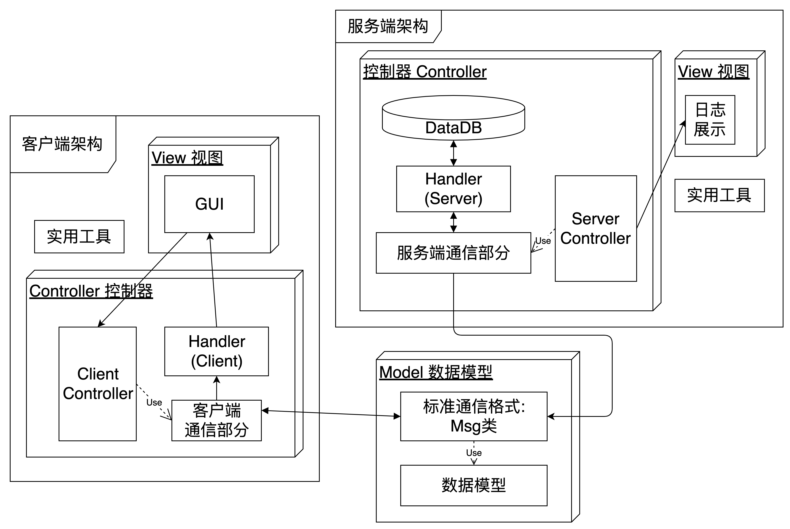

# 实现功能

+ 基本的聊天功能: **离线消息、群聊功能**

+ 基本的好友管理、个人信息管理功能: **添加好友**

+ 基本的文件和图片发送功能: **缓存式发送**

+ TIM一体化风格的聊天界面: **聊天气泡样式**

+ 基本的特殊消息: **窗口抖动**, **截屏**

# 项目亮点

+ **MVC架构**, **封装完备**, **全面向对象**, **可维护性强**

+ **用户界面友好**, **聊天体验优秀**

# UI展示

## 注册登录界面

### 注册界面

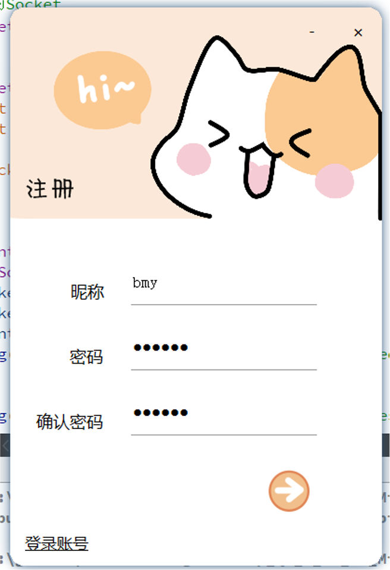

### 登陆界面

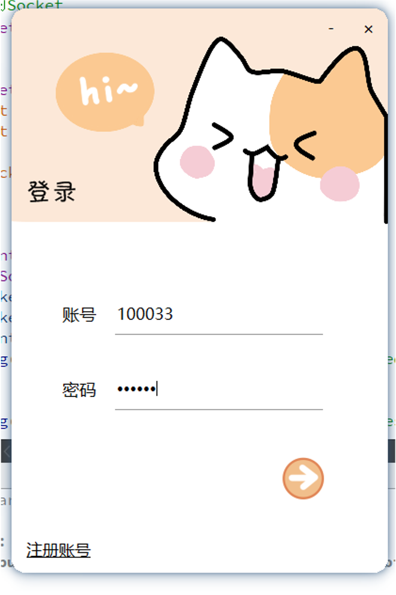

## 添加好友

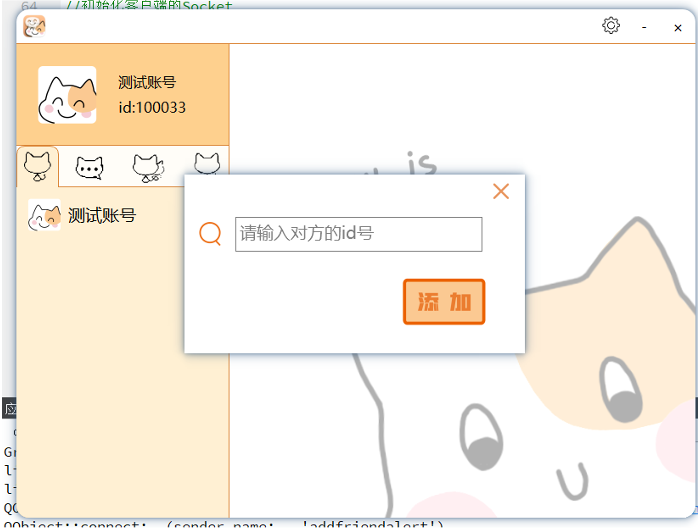

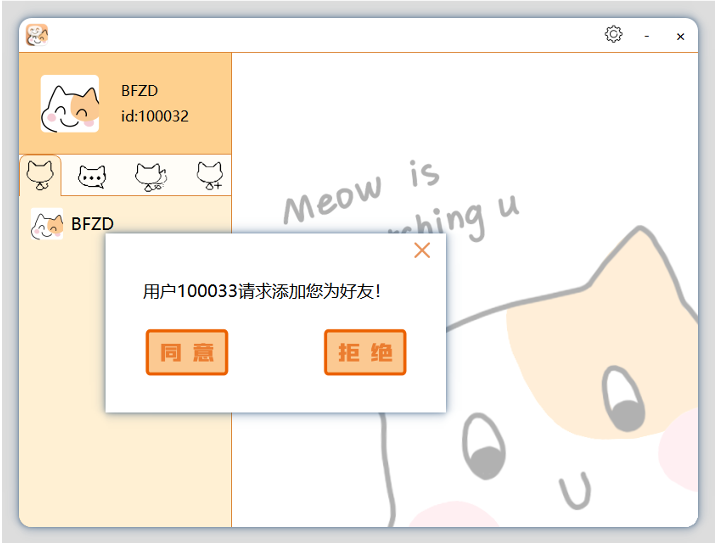

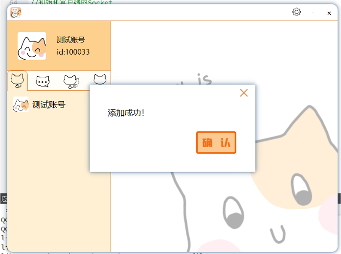

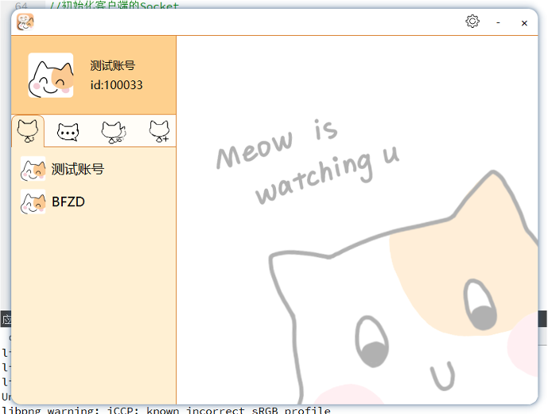

## 聊天界面

### 好友聊天

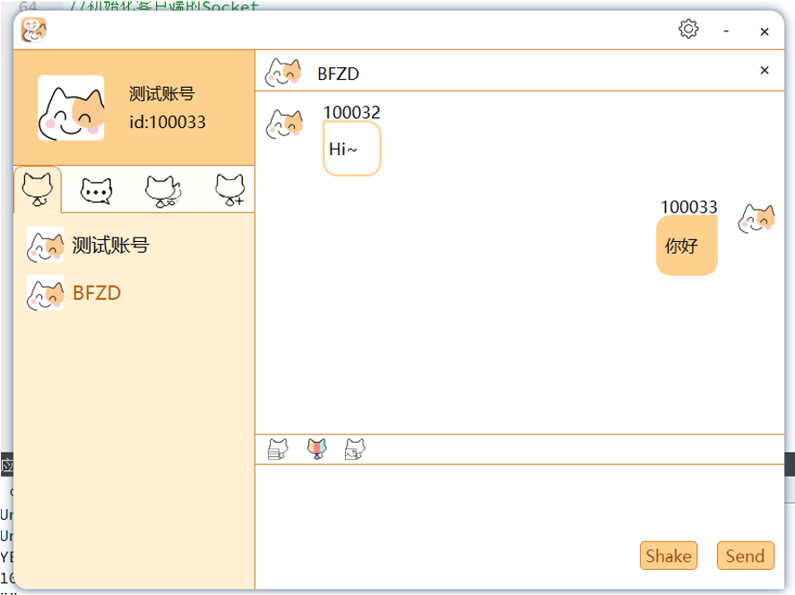

### 收到其他界面好友聊天消息

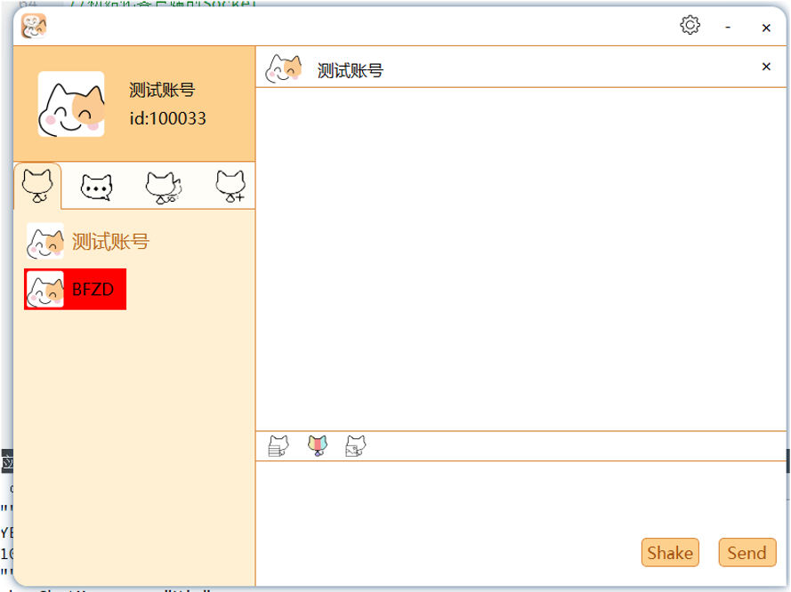

## 添加群聊

### 创建群聊

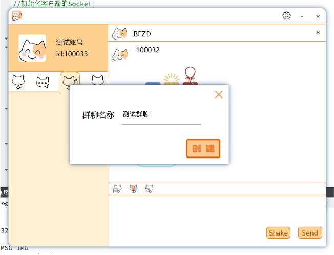

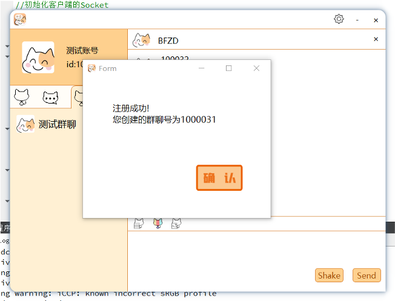

### 添加群聊

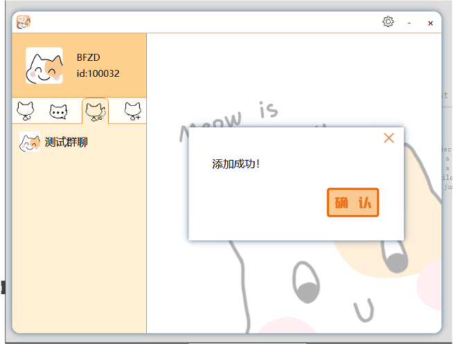

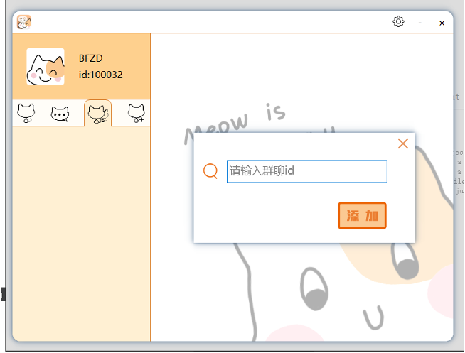

## 群聊界面

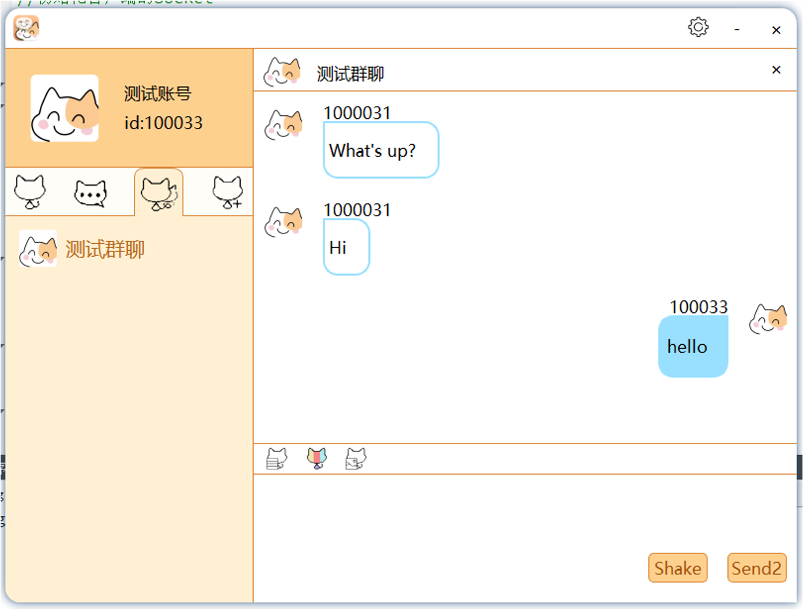

## 收发图片

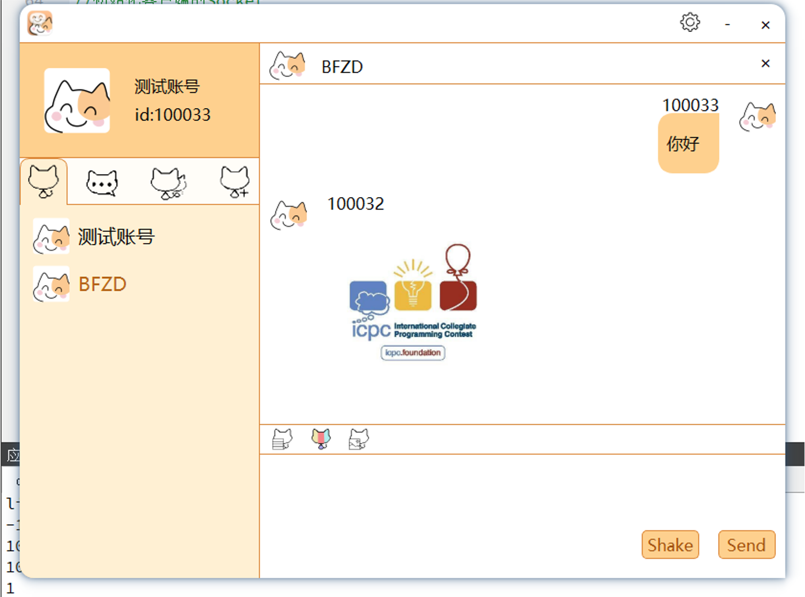

## 截屏功能

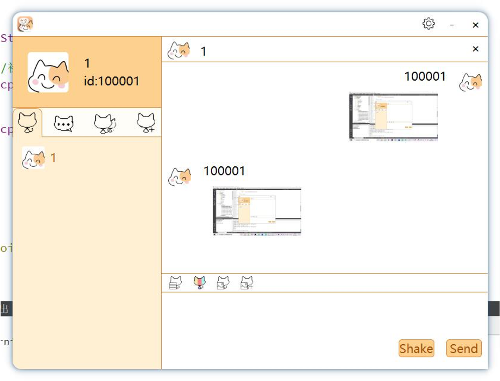

## 收发文件

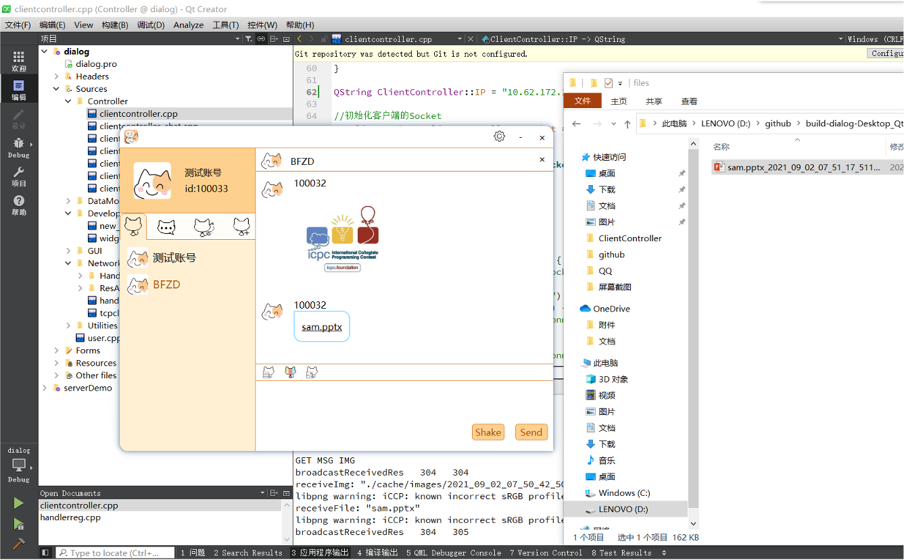

## 开发者模式

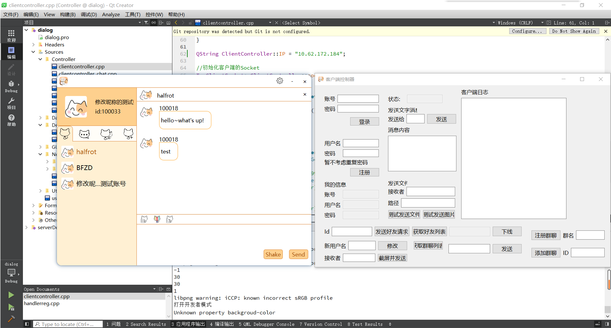
